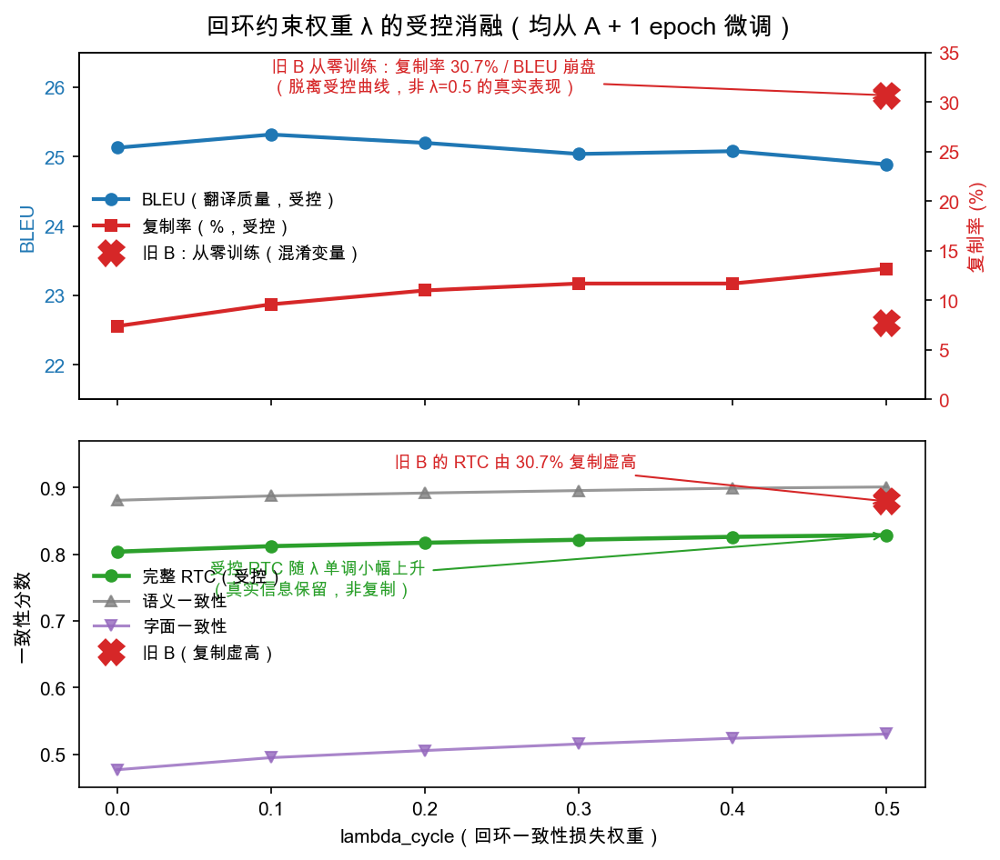

# 回环一致性实验结果记录

测试集：`data/processed/test.jsonl`，498 个句对 / 方向（seed=42 划分）。
评估脚本：`python -m ccnlp.eval_runner`（翻译质量）、`python -m ccnlp.rtc_eval`（回环一致性）、`python -m ccnlp.copy_rate`（复制坍缩诊断）、`scripts/dir_bertscore.py`（单向译文 vs 参考的 BERTScore 语义充分度）。

> **⚠️ 重要修正（变量控制）。** 早期版本曾把一条 `lambda_cycle=0.5` 的运行（下文「旧实验组 B」）当作「λ=0.5 的代表性结果」，并据此得出「λ=0.5 触发复制坍缩、应避免」的结论。该运行实际上是**从原始预训练权重直接训练 1 epoch**得到的，与其余消融点（均「从对照组 A 的权重继续微调 1 epoch」）相比，**同时改变了两个变量**：初始化权重 *和* 总训练量。因此它**不是对 λ=0.5 的有效测量**。
>
> 现已补做受控实验：在完全相同的协议下（从 A 的 3-epoch 权重继续微调 1 epoch，batch 16，lr 1e-5）分别跑 λ=0（`Aplus1`）与 λ=0.5（`L05m`），只改变 λ。受控结果**推翻了原结论**——λ=0.5 不发生坍缩；它单调提升回环可逆性（RTC），但**并不提升单向翻译质量**（详见文末结论）。旧 B 作为「回环约束从零训练」的**警示案例**保留在文末。

## 训练协议与变量控制

| 运行 | 初始化权重 | 回环损失训练量 | λ | 性质 |
|------|------------|----------------|---|------|
| 对照组 A | 原始 Randeng-BART | — （3 ep 标准翻译） | 0 | 命名基线 |
| `Aplus1`（matched λ=0） | **A 的 3-ep 权重** | +1 ep | 0 | ✅ 受控对照 |
| λ=0.1 / 0.2 / 0.3 / 0.4 | **A 的 3-ep 权重** | +1 ep | 0.1–0.4 | ✅ 受控消融 |
| `L05m`（matched λ=0.5） | **A 的 3-ep 权重** | +1 ep | 0.5 | ✅ 受控处理 |
| 旧实验组 B | **原始 Randeng-BART** | 1 ep | 0.5 | ❌ 混淆变量（见文末） |

`Aplus1` 是为 λ=0.5 准备的 matched 对照：它与 A 几乎相同（BLEU 25.13 vs 25.06，RTC 0.804 vs 0.8071），说明**多训 1 个 epoch 的标准翻译本身几乎不改变指标**——因此 `L05m` 相对 `Aplus1` 的增益可干净地归因于回环损失，而非额外训练量。

## 对照组 A：标准 Seq2Seq 基线（无回环约束，3 epoch）

- 模型：`IDEA-CCNL/Randeng-BART-139M-SUMMARY`
- 数据：NiuTrans 5 万句对（去重后 49826），双向展开
- 训练：3 epoch，batch 16，lr 5e-5，单卡
- checkpoint：`/data2/lyl/outputs/randeng-bart-niutrans`

| 方向 | BLEU | ChrF | ExactMatch | BERTScore F1 |
|------|------|------|------------|--------------|
| 古→今 | 22.33 | 23.38 | 0.006 | 81.59 |
| 今→古 | 28.75 | 26.85 | 0.020 | 84.71 |
| 总体 | 25.06 | 25.11 | 0.013 | 83.15 |

观察：
- 今→古方向显著优于古→今。
- 古→今存在幻觉（如「温故而知新」→ 凭空出现人名「张温」），疑似受史书类训练数据的人名模式影响——正是回环一致性约束意图缓解的信息失真。
- BERTScore F1（vs 参考，越高越好）现已在本地用 `bert-base-chinese` 补齐（脚本 `scripts/dir_bertscore.py`）：古→今 81.59、今→古 84.71、总体 83.15；今→古高于古→今，与 BLEU 趋势一致。

## 受控对比：回环一致性损失的真实效果（matched λ=0 vs λ=0.5）

这是衡量回环损失作用的**唯一干净的 A/B 对照**：两者都从 A 的 3-ep 权重继续微调 1 epoch，唯一区别是 λ。

- λ=0：`Aplus1` → `/data2/lyl/outputs/...`，`rtc_roundtrip_Aplus1.jsonl`
- λ=0.5：`L05m` → `/data2/lyl/outputs/randeng-bart-cycle-lambda0.5-matched`，`rtc_roundtrip_L05m.jsonl`

### 翻译质量（单向，λ=0 → λ=0.5）

含单向译文 vs 黄金参考的 BERTScore-F1（脚本 `scripts/dir_bertscore.py`）：

| 方向 | BLEU | ChrF | BERTScore-F1（vs 参考） |
|------|------|------|--------------------------|
| 古→今 | 22.26 → 21.55 | 23.44 → 23.16 | 81.61 → 81.41 |
| 今→古 | 28.93 → 27.62 | 26.83 → 26.89 | 84.68 → 84.35 |
| 总体 | 25.13 → 24.89 | 25.13 → 25.02 | 83.14 → 82.88 |

### 回环一致性与复制率（总体）

| 指标 | matched λ=0（Aplus1） | matched λ=0.5（L05m） | 变化 |
|------|----------------------|-----------------------|------|
| 总体 BLEU | 25.13 | 24.89 | **−0.24（基本持平）** |
| 复制率（相似度>0.8） | 7.4% | 13.2% | +5.8pp |
| 今译≈古文 平均相似度 | 0.512 | 0.583 | +0.071 |
| 字面一致性 | 0.4770 | 0.5305 | +0.0535 |
| 结构一致性 | 0.8998 | 0.9106 | +0.0108 |
| 语义一致性 | 0.8811 | 0.9011 | +0.0200 |
| 完整 RTC | 0.8040 | 0.8289 | **+0.0249** |

**结论：λ=0.5 的回环损失带来真实的回环一致性提升（RTC +0.0249、字面 +0.0535、回环语义 +0.0200），代价是单向翻译质量极小幅下降（BLEU −0.24、单向语义 BERTScore −0.26）、复制率温和上升（+5.8pp，远未坍缩）。** 它提升的是回环可逆性（RTC）而非单向翻译质量，且不存在原报告所称的「复制坍缩陷阱」；译质代价真实但可忽略（详见消融节的权衡表与文末结论）。

### 分组对比（matched λ=0 → matched λ=0.5）

回环损失在**所有分组上一致地提升 RTC**，且提升幅度与复制率的小幅上升不成比例——是真实的信息保留增益。

| 分组 | λ=0 字面 | λ=0.5 字面 | λ=0 结构 | λ=0.5 结构 | λ=0 语义 | λ=0.5 语义 | λ=0 RTC | λ=0.5 RTC |
|------|----------|------------|----------|------------|----------|------------|---------|-----------|
| 古→今→古 | 0.5047 | 0.5668 | 0.9201 | 0.9378 | 0.8963 | 0.9196 | 0.8228 | 0.8526 |
| 今→古→今 | 0.4494 | 0.4942 | 0.8795 | 0.8834 | 0.8659 | 0.8827 | 0.7853 | 0.8052 |
| 短句(<20) | 0.4928 | 0.5427 | 0.9229 | 0.9297 | 0.8814 | 0.8996 | 0.8120 | 0.8343 |
| 中句(20-50) | 0.4687 | 0.5239 | 0.8936 | 0.9081 | 0.8836 | 0.9050 | 0.8026 | 0.8294 |
| 长句(>50) | 0.4116 | 0.4799 | 0.7508 | 0.7636 | 0.8562 | 0.8810 | 0.7462 | 0.7773 |
| 低虚词（仅古→今→古） | 0.5184 | 0.5762 | 0.9219 | 0.9372 | 0.9012 | 0.9229 | 0.8288 | 0.8564 |
| 高虚词（仅古→今→古） | 0.4316 | 0.5164 | 0.9109 | 0.9409 | 0.8707 | 0.9019 | 0.7909 | 0.8326 |
| 三国志 | 0.4622 | 0.5145 | 0.9210 | 0.9278 | 0.8809 | 0.9008 | 0.8052 | 0.8289 |
| 世说新语 | 0.3974 | 0.4612 | 0.9027 | 0.9100 | 0.8503 | 0.8752 | 0.7702 | 0.7994 |
| 中庸 | 0.3677 | 0.4226 | 0.8595 | 0.8796 | 0.8442 | 0.8672 | 0.7520 | 0.7808 |
| 仪礼 | 0.3912 | 0.4300 | 0.8396 | 0.8719 | 0.8402 | 0.8597 | 0.7502 | 0.7762 |
| 伤寒论 | 0.3771 | 0.4390 | 0.8614 | 0.8759 | 0.8528 | 0.8761 | 0.7594 | 0.7886 |
| 元史 | 0.5306 | 0.5866 | 0.8940 | 0.9054 | 0.8980 | 0.9174 | 0.8237 | 0.8489 |

- 高虚词、长句这类基线最弱的分组，回环损失的相对增益最大（高虚词 RTC +0.0417，长句 +0.0311）——回环约束对「难句」帮助更明显，且这一次的增益不再被复制坍缩污染。
- 古→今→古方向（+0.0298）增益大于今→古→今（+0.0199），与「古文信息密度更高、回环约束更有抓手」一致。

### 定性案例：回环损失提升信息保留

下表从受控消融文件中选取代表性样本，对照均为 `Aplus1`（A + 1 epoch，λ=0）。这些案例不只看 RTC 分数，而是关注回译中是否保留了否定关系、数字、专名、官职、动作细节等关键信息。

| 类型 | 方向 | λ | 原文 | matched λ=0 回译 | 加回环后回译 | 体现出的优势 |
|------|------|---|------|------------------|--------------|--------------|
| 否定关系 | 今→古→今 | 0.3 | 祖常不以为然。 | 祖常认为他说得对。 | 祖常不以为然。 | 保留「不以为然」的否定语义，避免把态度翻反。 |
| 数字信息 | 今→古→今 | 0.1 | 三年世延弹劾帖木迭儿十三条罪恶，诏夺其官职。 | 三年，世延弹劾帖木迭儿四条罪恶，诏夺其官职。 | 三年，世延弹劾帖木迭儿十三条罪恶，诏夺其官职。 | 保留「十三条」这一关键数量信息。 |
| 专名 / 书名 | 今→古→今 | 0.1 | 查找《洛书甄曜度》中说：赤三日德昌，九世会备，合为帝际。 | 查找洛阳书信甄曜度说：赤乌三日，德昌九世，会合为帝。 | 查找洛书甄曜度说：赤三日德昌，九世会备，合为帝际。 | 减少专名误改，保留「洛书甄曜度」和原句核心短语。 |
| 人名 / 官职 | 今→古→今 | 0.1 | 任命高堂隆为给事中、博士、驸马都尉。 | 任命隆为给事中、博士、驸马都尉。 | 任命高堂隆为给事中、博士、驸马都尉。 | 保留完整人名「高堂隆」，避免只剩名或泛化指代。 |
| 动作细节 | 今→古→今 | 0.2 | 田豫秘密布置，让司马高举战旗，击鼓，率步兵从南门出击。 | 田豫暗中谋划，让司马举旗击鼓，从南门出兵。 | 田豫秘密布置，派司马举旗击鼓，率领步兵从南门出击。 | 保留「率步兵」「从南门出击」等事件细节。 |
| 机构 / 动作 | 古→今→古 | 0.2 | 诏谕四川宣慰司括军民户数。 | 诏谕四川宣慰司，籍军民户。 | 诏谕四川宣慰司括军民户数。 | 保留「括军民户数」这一具体行政动作。 |
| 句法结构 | 古→今→古 | 0.2 | 主人北面立于东楹东，侑西楹西北面立。 | 主人北面东楹东，侑西楹西，西北面立。 | 主人北面立于东楹东，侑西楹西北面立。 | 保留「立于」和方位结构，减少结构拆散。 |

古→今方向还需额外确认中间译文不是直接照抄古文。下表列出若干古→今→古案例的中间今译：它们仍是白话化表达，但回译更接近原文，说明收益不是单纯复制造成的。

| λ | 古文原句 | 加回环后的中间今译 | 加回环后回译 | 说明 |
|---|----------|--------------------|--------------|------|
| 0.1 | 肃与诸将议。 | 鲁肃和将领们商议。 | 肃与诸将议。 | 中间译文是自然白话，回译去除了 Aplus1 中多出的「议计」。 |
| 0.3 | 且民恶其上，动见瞻观，何时易哉？ | 况且百姓厌恶其上，动见瞻观，何时容易呢？ | 且民恶其上，动见瞻观，何时易乎？ | 保留「民恶其上」「动见瞻观」等关键结构。 |
| 0.4 | 未几，以母疾辞归。明年，丁内艰。 | 不久，因母病辞职归家。第二年，丁内艰。 | 未几，以母病辞归。明年，丁内艰。 | 保留「丁内艰」这一文言专门表达。 |

## lambda_cycle 受控消融：平缓平台（无悬崖），但单向译质不增反微降

固定其余设置（从 A 的 3-ep 权重继续微调 1 epoch，batch 16，lr 1e-5），只扫 `lambda_cycle`（λ=0 用 matched `Aplus1`，λ=0.5 用 matched `L05m`，0.1–0.4 为同协议消融点）：

| lambda | BLEU | ChrF | 复制率 | 字面一致性 | 结构一致性 | 语义一致性 | 完整 RTC |
|--------|------|------|--------|------------|------------|------------|----------|
| 0（Aplus1） | 25.13 | 25.13 | 7.4% | 0.4770 | 0.8998 | 0.8811 | 0.8040 |
| 0.1 | 25.32 | 25.33 | 9.6% | 0.4951 | 0.9032 | 0.8877 | 0.8123 |
| 0.2 | 25.20 | 25.21 | 11.0% | 0.5058 | 0.9051 | 0.8920 | 0.8174 |
| 0.3 | 25.04 | 25.17 | 11.7% | 0.5156 | 0.9069 | 0.8957 | 0.8219 |
| 0.4 | 25.08 | 25.18 | 11.7% | 0.5241 | 0.9095 | 0.8992 | 0.8263 |
| 0.5（L05m） | 24.89 | 25.02 | 13.2% | 0.5305 | 0.9106 | 0.9011 | 0.8289 |

*图：回环约束权重 λ 的受控消融（脚本 `scripts/plot_ablation.py`，所有点均从 A + 1 epoch 微调）。上栏——BLEU（蓝）全程平稳在 ~25，复制率（红）从 7.4% 温和升到 13.2%。下栏——完整 RTC 与三层一致性随 λ 单调小幅上升（这是回环可逆性的提升、非复制坍缩造成，但**不等于单向翻译质量**）。红色 ✕ 为「旧 B：从零训练」的离群点，明显脱离受控曲线：BLEU 崩到 22.60、复制率暴涨到 30.7%、RTC 被复制虚高到 0.8795——这不是 λ=0.5 的真实表现。*

### 单向语义充分度（BERTScore vs 参考）与 λ 的真实权衡

为区分「回环自洽」与「翻译是否真的对」，补算了**单向译文与黄金参考**的 BERTScore-F1（脚本 `scripts/dir_bertscore.py`，同一 `bert-base-chinese`，与回环语义同源）。与单向 BLEU、回环 RTC 并列：

| λ | 单向 BLEU | 单向 ChrF | 单向语义 BERTScore（vs 参考） | 回环 RTC |
|---|-----------|-----------|-------------------------------|----------|
| 0（Aplus1） | 25.13 | 25.13 | 83.14 | 0.8040 |
| 0.1 | 25.32 | 25.33 | 83.18 | 0.8123 |
| 0.2 | 25.20 | 25.21 | 83.09 | 0.8174 |
| 0.3 | 25.04 | 25.17 | 83.02 | 0.8219 |
| 0.4 | 25.08 | 25.18 | 82.97 | 0.8263 |
| 0.5（L05m） | 24.89 | 25.02 | 82.88 | 0.8289 |

这一栏回答了「λ=0.5 的 BLEU 下降是不是只是换了说法」：**不是**——单向语义 BERTScore 与 BLEU **同步**小幅下滑（λ=0→0.5 仅 −0.26 / 100），说明译质确有真实但极小的下降，而非单纯改写。换言之：**回环一致性（RTC）随 λ 单调上升，单向翻译质量随 λ 极小幅下降，二者构成一个真实但温和的权衡。**

观察：

- **回环一致性损失在 λ∈[0.1, 0.5] 不存在「悬崖」，是一条平缓平台。** 复制率温和单调上升（7.4%→13.2%），完整 RTC 单调上升（0.804→0.829），字面/结构/回环语义同步提升，无相变。原报告「λ=0.5 触发坍缩、应避免」的叙事被推翻。
- **但单向翻译质量并未被提升。** 单向 BLEU 与单向语义 BERTScore 都在 **λ=0.1 见顶**（且该增益落在单 seed 噪声内），λ>0.1 后两项**同步小幅下滑**。也就是说：回环损失单调改善的是「回环可逆性（RTC）」，**不是**单向翻译质量；后者随 λ 极小幅下降。这是一项性质换另一项性质的**权衡**，而非免费提升。
- **取值建议：**
  - **若以单向翻译质量为唯一目标** → 取 **λ=0（不加约束）**，或 **λ=0.1**（与基线持平，可作无害的轻量正则）；λ>0.1 只会让译质小幅变差。
  - **仅当「信息可逆 / 不丢失」本身是交付目标时** → 可在 **λ≤0.4** 内按需取值（RTC 拿到约九成增益、单向译质代价可忽略），λ=0.5 相对 0.4 边际不划算。
- 注：相邻 λ 的各项差异约 0.004–0.005，与单 seed 噪声同量级；任何精细排序都建议多 seed 复跑确认。

## 复制坍缩：训练阶段效应，而非 λ 量级效应

复制坍缩仍是一个真实且重要的失败模式——只是它的**触发条件被修正了**：它由「**在模型尚不会翻译时就施加强回环损失**」诱发，而**不是**由 λ 的大小诱发。

诊断方法（脚本 `ccnlp.copy_rate`）：在古→今方向度量「今译（中间步）」与古文原句的相似度（`1 − 归一化编辑距离`）。真正的白话翻译应与古文差异较大；若今译≈古文，即发生复制坍缩。

| 模型 | 训练方式 | 今译≈古文 相似度 | 复制率（>0.8） | BLEU | RTC |
|------|----------|------------------|----------------|------|-----|
| matched λ=0（Aplus1） | A + 1 ep，λ=0 | 0.512 | 7.4% | 25.13 | 0.804 |
| **matched λ=0.5（L05m）** | **A + 1 ep，λ=0.5** | 0.583 | **13.2%** | **24.89** | 0.829 |
| 旧 B（混淆） | **从零 1 ep，λ=0.5** | 0.698 | **30.7%** | **22.60** | 0.8795 |

- **同样是 λ=0.5：从 A 微调（L05m）复制率仅 13.2%、BLEU 持平；从零训练（旧 B）复制率飙到 30.7%、BLEU 崩到 22.60。** 差别不在 λ，而在**是否先有一个会翻译的模型**。模型尚不会翻译时，满足回环闭环最省力的方式就是「照抄原文」；一旦模型已能翻译（A），同样强度的回环损失就不再诱发坍缩，只温和地改变回环可逆性。
- **方法论结论（保留并强化）：RTC 可被「照抄」钻空子而虚高（旧 B 的 RTC 0.8795 即如此），因此必须与翻译质量（BLEU）和复制率诊断联合判读。** 正是复制率诊断暴露了旧 B 的异常——这是本实验对 RTC 评价框架的核心贡献，不受修正影响。
- **实践建议：若要使用回环损失，应作为对已收敛翻译模型的微调施加（而非从初始化即开启），以免诱发复制坍缩。**

## 幻觉 / 忠实度评测：回环损失的真实收益（BLEU/BERTScore 看不见）

项目初衷是治幻觉（古→今 凭空人名 / 数字，如「温故而知新」→「张温」），而 BLEU/BERTScore 对幻觉不敏感，此前从未直接度量。新增轻量度量（脚本 `python -m ccnlp.hallucination`，无新依赖）：
- **数字幻觉**：译文中「源与参考都没有」的数字 = 凭空数字；并报参考数字保留率。
- **内容字幻觉率**：译文内容字（去虚词 / 标点 / 数字）中「既不在源也不在参考」的占比。

古→今，n=498（复制率列取自前文「复制坍缩」诊断，用于对照）：

| λ | 复制率 | 含幻觉数字句% | 词级数字幻觉% | 参考数字保留% | 内容字幻觉率 |
|---|--------|---------------|----------------|----------------|---------------|
| 0（Aplus1） | 7.4 | 12.0 | 20.8 | 57.4 | 0.1912 |
| 0.1 | 9.6 | 11.2 | 19.7 | 56.9 | 0.1711 |
| 0.2 | 11.0 | 11.2 | 19.9 | 56.7 | 0.1611 |
| 0.3 | 11.7 | 10.6 | 18.7 | 56.2 | 0.1570 |
| 0.4 | 11.7 | 10.2 | 17.7 | 58.4 | 0.1477 |
| 0.5（L05m） | 13.2 | 10.0 | 17.3 | 58.2 | 0.1422 |
| 旧 B（L05，从零） | 30.7 | 5.8 | 10.8 | 53.6 | 0.0828 |

- **回环损失单调降幻觉。** 沿受控扫描：凭空数字句 12.0%→10.0%、词级数字幻觉 20.8%→17.3%、内容字幻觉 0.1912→0.1422，全部单调下降，而**参考数字保留率不降反升（57→58%）**（不是靠删数字作弊）。**这是 BLEU/BERTScore 看不见、却正中项目初衷的一条轴。**
- **λ=0.1 是全面赢点。** 那里 BLEU↑、BERTScore↑、幻觉↓，且复制率几乎不动（+2.2pp）——四个轴同时变好。更高 λ 才进入「拿少量 BLEU / 更多复制 换更低幻觉」的权衡。
- **去混淆检验（关键）：剔除照抄句后，幻觉下降依然成立——故为真实收益，而非复制假象。** 复制会人为压低幻觉指标（旧 B 复制率 30.7%、幻觉骤降到 5.8% / 0.0828 即复制假象）。用 `--exclude_copies 0.8` 剔除「译文照抄源句」的句子（剔除数随 λ 由 37 增至 66，恰合复制率 7.4%→13.3%）后重算：

| λ | n（剔除照抄后） | 含幻觉数字句% | 内容字幻觉率 |
|---|------------------|---------------|---------------|
| 0（Aplus1） | 461 | 13.0 | 0.2039 |
| 0.1 | 450 | 12.4 | 0.1861 |
| 0.2 | 443 | 12.6 | 0.1775 |
| 0.3 | 440 | 12.0 | 0.1740 |
| 0.4 | 440 | 11.6 | 0.1637 |
| 0.5（L05m） | 432 | 11.6 | 0.1596 |

  剔除照抄后内容字幻觉率仍**单调下降** 0.2039→0.1596（−0.0443，约为含复制时降幅 −0.0490 的 **90%**），数字幻觉句率亦总体下降（13.0%→11.6%）。**即复制只解释约一成，绝大部分忠实度增益是真实的。**
- **局限**：内容字幻觉率为代理指标——既被「照抄」压低（已用 `--exclude_copies` 去混淆），又可能被「与单一参考不同的合法改写」抬高（假阳性）；数字幻觉更干净但更稀疏（去混淆后有噪声）。

## 结论

1. **在表层 / 语义翻译指标上，回环损失不带来提升。** 单向 BLEU 与单向语义 BERTScore 均在 λ=0.1 见顶（增益在单 seed 噪声内），λ>0.1 后小幅下滑（λ=0→0.5：BLEU −0.24、单向语义 −0.26）。
2. **但在「忠实度 / 幻觉」这条更贴合项目初衷的轴上，回环损失单调降幻觉，且经去混淆检验确为真实。** 凭空数字句 12%→10%、内容字幻觉 0.191→0.142，参考数字保留率不降；**剔除照抄句后内容字幻觉仍单调降 0.204→0.160（约保留九成降幅）**，证明并非复制假象。这是 BLEU/BERTScore 看不见、正中项目初衷的真实收益。
3. **综合取值：λ=0.1 在 BLEU / BERTScore / 幻觉三方面同时改善且几乎不增复制，是最稳的「全面赢点」**；偏重降幻觉可取更大 λ（≤0.4），代价是少量 BLEU 与更多复制。
4. **方法论贡献（强化）：** RTC 与幻觉指标**都**可被复制坍缩钻空子虚高，必须与复制率联合判读；严格变量控制（matched：同初始化、同训练量、只变 λ）纠正了旧 B「λ=0.5 触发坍缩、应避免」的误判（坍缩实为「从零训练即施加强回环损失」的训练阶段效应）。本项目进一步实现了**推理期抗幻觉解码**（source-copy 偏置 + 忠实度重排，含反照抄惩罚；脚本 `scripts/faithful_eval.py`），用于在**不依赖复制**的前提下降幻觉，结果见下节（服务器评测）。
5. **局限：** 单模型 / 单数据集 / 单 seed / λ≤0.5；幻觉为轻量启发式（数字干净、内容字为代理）。

## 抗幻觉解码（推理期，无重训）—— 服务器评测待填

方法（已实现，`src/ccnlp/faithful_decode.py`）：
- **source-copy 偏置解码**：`SourceCopyBiasProcessor` 对源句中数字 / 内容字对应 token 抬高 logits，鼓励数字、专名被「抄」而非「编」（温和偏置，仅作用于数字 / 内容字）。
- **N-best 忠实度重排**：beam 取 k 个候选，按「源端忠实度 + 回环一致性 − 照抄惩罚」选最优；**只用源句、不看参考**（避免泄漏），其中回环一致性把训练期失败的 cycle 信号重新用作解码期选择准则，**反照抄惩罚**确保不把复制坍缩选回来。

评测脚本 `scripts/faithful_eval.py`，在服务器某 checkpoint 上跑四 mode（baseline / copybias / rerank / both），下表待跑：

| mode | BLEU | ChrF | BERTScore | 含幻觉数字句% | 参考数字保留% | 内容字幻觉率 | 复制率 |
|------|------|------|-----------|---------------|----------------|---------------|--------|
| baseline | 待填 | 待填 | 待填 | 待填 | 待填 | 待填 | 待填 |
| copybias | 待填 | 待填 | 待填 | 待填 | 待填 | 待填 | 待填 |
| rerank | 待填 | 待填 | 待填 | 待填 | 待填 | 待填 | 待填 |
| both | 待填 | 待填 | 待填 | 待填 | 待填 | 待填 | 待填 |

判读要点：好的抗幻觉方法应**降幻觉但不升复制率、且 BLEU 不显著下降**——这正是它区别于「靠复制刷低幻觉」的关键。

## 附：旧实验组 B —— 回环约束从零训练的警示案例（混淆变量，勿作 λ=0.5 结论依据）

- 模型：`IDEA-CCNL/Randeng-BART-139M-SUMMARY`
- 训练：**从原始权重**直接训练 1 epoch，λ=0.5（**未**从对照组 A 继续）
- checkpoint：`/data2/lyl/outputs/randeng-bart-cycle`

| 方向 | BLEU | ChrF | ExactMatch | BERTScore-F1（vs 参考） |
|------|------|------|------------|--------------------------|
| 古→今 | 19.16 | 21.02 | 0.006 | 79.82 |
| 今→古 | 20.86 | 23.70 | 0.014 | 80.85 |
| 总体 | 22.60 | 22.36 | 0.010 | 80.34 |

为何保留：旧 B 是「在模型尚不会翻译时施加强回环损失」的反面教材，其 30.7% 的复制率（matched λ=0.5 仅 13.2%、基线仅 7.4%）直观演示了复制坍缩，也演示了 RTC 如何被复制虚高。

为何不可作为 λ=0.5 结论：旧 B 相对其余消融点同时改变了初始化权重与总训练量两个变量；其单向 BLEU（19.16 / 20.86）与总体 BLEU（22.60）本身亦不自洽（语料 BLEU 不应高于两个方向）。λ=0.5 的有效测量请以 matched 的 `L05m` 为准。

该运行对应回环文件 `rtc_roundtrip_L05.jsonl`，由其重算 BLEU = 22.60 与本表逐格吻合，已确认它即旧 B（而非受控的 `L05m`）。其单向语义 BERTScore 总体仅 80.34，比基线（83.15）低 2.8，远超 matched 各点零点几的波动——从语义轴再次印证旧 B 的翻译真实退化（复制坍缩 + 欠训），与受控曲线不是一回事。

典型案例（古→今→古，旧 B 从零训练发生复制坍缩）：

| 古文原句 | A 基线今译（真翻译） | 旧 B 今译（照抄古文） |
|----------|----------------------|------------------------|
| 皆宜临时消息制方，无不效也。 | 都是应该根据实际情况制定方略，不能没有效果。 | 都是应该临时消息制方，无不效法。 |
| 然天实为之，谓之何哉！ | 然而天真的做这样的事，是何谓呢？ | 然而天实为之，谓之何哉！ |
